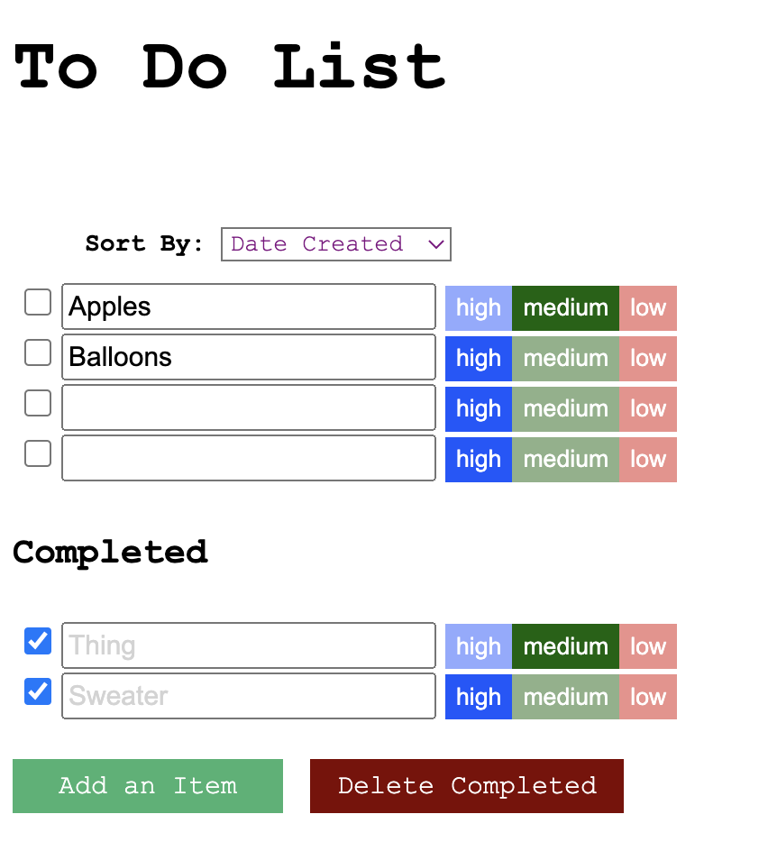

# Design Document

### Design decisions
In our previous iteration, we went from having only one list of all of our tasks to having an uncompleted 
and completed list section. 

From  to 

Additionally, not only can the user change the text of their task and complete/uncomplete it, but also
specify its priority level (high, medium, low).

We also added a sorting feature, so that the user can sort their to do list according to name (alphabetical),
 priority (low, medium high), and date created.

In our newest iteration, the user can access multiple to do lists.

With the multiple to do lists functionality, we added options for the user to
select, edit, add, and delete lists. Below is the dropdown for selecting different to do lists.

### Alternative designs
We considered using a pop-up message that a user can respond to when they want to add a to-do, but we felt like that 
would make the app too complicated. 

For the multiple to do lists function, we considered having the user edit the name of the list in the same location of the dropdown,
 but we decided having a new line for the user to edit the name was simpler.

### User testing
We tested with the same potential user as last time, and she liked that we changed from "Add a todo" to "Add." She also 
enjoyed that the "Done" button no longer exists, which she mentioned last time as redundant.

### Challenges we faced
Similar to the previous iteration, keeping track of the uncompleted and completed tasks were difficult. Additionally,
 implementing multiple todo lists posed a challenge, as we had to reorganize our Firebase collections.

### Parts of the design we're most proud of
To make the app more accessible to different screen sizes, we implemented a dropdown for the tasks' priority levels 
when the user's window was small.

So, from   to  when the user makes their screen smaller.

### Videos of accessibility functions
Using our application entirely from the keyboard - https://youtu.be/CB8B5v1TiCg

Using our application using a screenreader - https://youtu.be/os7RTLp9hFo