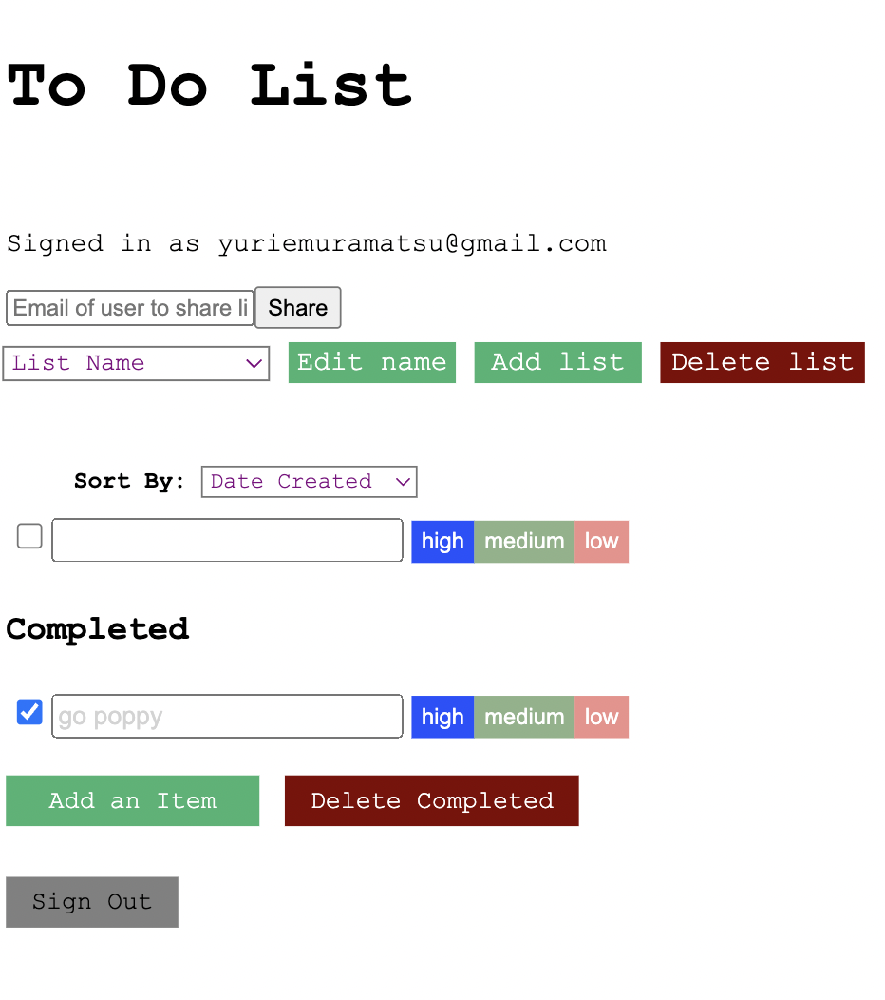

# Design Document

### Design decisions
Positioning of each element was a challenge in this final lab, because we now have so many 
things we need to display, such as the list of lists, edit, add and delete of such lists, 
as well as completed and uncompleted lists. We played around with them and came to the final
decision of where they are now!

### Alternative designs
We considered positioning Log In button and Sign up button in completely separate screens,
which would be we would firstly have one screen just with those buttons alone, and secondly
when the user clicks on either button, you get directed to a Login page and Signup page.
However, we wanted to minimize the number of steps that needs to be taken for a user, so we 
decided to have a Login page as default with a Signup button at the bottom, and when a user 
clicks the Signup button, they get directed to a Signup page with a Login option at the bottom.

### User testing
We tested with the same person we tested the lab 1 with. She said that the app was simple 
and easy to follow and understand, and that instructions given were always clear.

### Challenges we faced
The hardest part was figuring out the security rules and implementing functions and displays
of the app accordingly, because there are so many patterns that are possible.

### Parts of the design we're most proud of

We are quite proud of our error messages that are clear and concise and do not give the user
too much information which can often be confusing; they deliver the exact meaning we want the 
user to receive.

